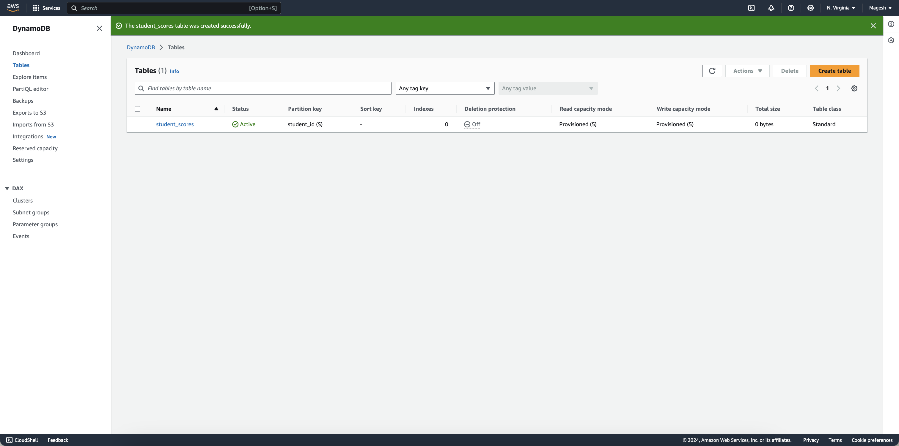

# Automated Student Progress Notification System

---

**Table of Contents**

1. [Project Overview](#project-overview)
2. [Serverless Architecture](#serverless-architecture)
3. [Components and Configuration](#components-and-configuration)
   - [S3 Bucket](#s3-bucket)
   - [DynamoDB Table](#dynamodb-table)
   - [SNS Topic](#sns-topic)
   - [Lambda Function](#lambda-function)
4. [Implementation Steps](#implementation-steps)
   - [Creating S3 Bucket](#creating-s3-bucket)
   - [Setting Up DynamoDB Table](#setting-up-dynamodb-table)
   - [Configuring SNS Topic and Email Subscription](#configuring-sns-topic-and-email-subscription)
   - [Creating and Configuring Lambda Function](#creating-and-configuring-lambda-function)
   - [Integrating S3 Trigger with Lambda](#integrating-s3-trigger-with-lambda)
5. [Code Implementation](#code-implementation)
   - [Lambda Function Code](#lambda-function-code)
   - [Boto3 Configuration](#boto3-configuration)
6. [Testing](#testing)
   - [Uploading CSV File](#uploading-csv-file)
   - [Verification of DynamoDB Entries](#verification-of-dynamodb-entries)
   - [Checking Email Notifications](#checking-email-notifications)
7. [Conclusion](#conclusion)
8. [Key Learnings](#key-learnings)
9. [References](#references)
10. [Broadcast link](broadcast-link)

---

## Project Overview

The project automates notifying students about their progress based on a CSV file uploaded to an Amazon S3 bucket. It uses AWS services including S3, DynamoDB, SNS, and Lambda to:

- **CSV Upload:** Users upload a CSV file to an S3 bucket.
- **Data Processing:** Lambda function processes the CSV and updates DynamoDB.
- **Notification:** Lambda triggers SNS to send email notifications to students.

## Serverless Architecture


The architecture involves:

1. **Amazon S3:** Stores the CSV file.
2. **AWS Lambda:** Processes the file, updates DynamoDB, and triggers SNS.
3. **Amazon DynamoDB:** Stores student data.
4. **Amazon SNS:** Sends notifications.

## Components and Configuration

### S3 Bucket

- **Purpose:** Store the CSV file & to Trigger Lambda function on file upload.
- **Configuration:**
  - Bucket Name: `my-csv-uploads`

### DynamoDB Table

- **Purpose:** Store student details.
- **Configuration:**
  - Table Name: `student_scores`
  - Key Schema: `studentid` (Partition Key)
  - Attributes: `studentid`, `name`, `percentage`, `email`

### SNS Topic

- **Purpose:** Notify students via email.
- **Configuration:**
  - Create a new Topic with name: `aws_test_lambda`
  - Email Subscription: Subscribed emails receive notifications.

### Lambda Function

- **Purpose:** Process the CSV, update DynamoDB, and trigger SNS.
- **Configuration:**
  - Lambda Function Name: `process-csv-file`
  - Runtime: Python 3.x
  - IAM Role: Permissions for S3, DynamoDB, and SNS.
  - Trigger: S3 event notification
  
  
## Implementation Steps

### Creating S3 Bucket

1. Log in to AWS Management Console.
  
  
   
2. Navigate to S3 and create a bucket.

    

### Setting Up DynamoDB Table

1. Go to DynamoDB in AWS Management Console.
2. Create a table with the specified schema.
3. Configure primary key and attributes.

    


### Configuring SNS Topic and Email Subscription

1. Navigate to SNS in AWS Management Console.
2. Create a new SNS topic.

    
   
4. Configure email subscriptions..

    

### Creating and Configuring Lambda Function

1. Go to AWS Lambda in Management Console.
2. Create a Lambda function with Python runtime and Attach IAM role with permissions for S3, DynamoDB, and SNS..

    
   
3. Write Lambda function code.

    

### Integrating S3 Trigger with Lambda

1. Configure S3 bucket event notification to trigger Lambda.
2. Ensure proper event types (e.g., PUT events).

    

## Code Implementation

### Lambda Function Code

```python
import boto3
import json
import csv
from datetime import datetime

dynamodb = boto3.resource('dynamodb')
ses = boto3.client('ses', region_name='us-east-1')  # Your SES region
sns = boto3.client('sns')
table = dynamodb.Table('student_scores')  # Your DynamoDB table name
sns_topic_arn = 'arn:aws:sns:us-east-1:007034119270:student-performance-reports'  # Your SNS topic ARN
SENDER_EMAIL = 'mageshnarayanaswamy5@gmail.com'  # Your verified SES email

def lambda_handler(event, context):
    bucket_name = event['Records'][0]['s3']['bucket']['name']
    file_key = event['Records'][0]['s3']['object']['key']
    s3_client = boto3.client('s3')

    # Download the file from S3
    s3_client.download_file(bucket_name, file_key, '/tmp/temp_file.csv')

    students = []
    with open('/tmp/temp_file.csv', 'r') as file:
        reader = csv.DictReader(file)
        for row in reader:
            # Process each row and insert into DynamoDB
            day = datetime.now().strftime('%d')
            month = datetime.now().strftime('%B')
            time = datetime.now().strftime('%H:%M:%S')
            table.put_item(
                Item={
                    'student_id': row['student_id'],
                    'name': row['name'],
                    'percentage': row['percentage'],
                    'email': row['email'],
                    'day': day,
                    'month': month,
                    'time': time
                }
            )
            students.append({
                'name': row['name'],
                'percentage': row['percentage'],
                'email': row['email']
            })

    # Publish to SNS for each student
    for student in students:
        subject = "Performance Report"
        body = f"""
        Hello {student['name']},

        We have processed your performance. Here are your performance details:
        
        Percentage: {student['percentage']}%
        
        If you have any questions or need further assistance, please let us know.

        Best regards,
        Your Team
        """

        message = {
            'default': body,
            'email': body
        }

        sns.publish(
            TopicArn=sns_topic_arn,
            Subject=subject,
            MessageStructure='json',
            Message=json.dumps(message)
        )

    return {
        'statusCode': 200,
        'body': json.dumps('File processed and emails sent successfully')
    }

```

### Boto3 Configuration

Ensure the AWS SDK for Python (Boto3) is installed and configured with the appropriate credentials.

## Testing

### Uploading CSV File

Upload a sample CSV to the S3 bucket and verify Lambda triggers.


### Verification of DynamoDB Entries

Check DynamoDB for correct data storage.


### Checking Email Notifications

Verify that emails are received and contain correct information.


## Conclusion

This system uses AWS services to automate student progress updates and notifications, ensuring a seamless workflow. It can be deployed on AWS Elastic Beanstalk, where you may also integrate a user interface, enhancing interaction and usability while maintaining the simplicity of the serverless architecture

## Key Learnings

- **Creating a Fully Serverless Architecture:** Gained experience in designing and implementing a complete serverless architecture using AWS services.
- **Automated Event Notifications with S3:** Learned to leverage Amazon S3 to automatically trigger events when files are uploaded, enabling seamless integration with other AWS services.
- **Lambda Functions for File Processing:** Developed Lambda functions that are triggered by S3 events to process CSV files. This includes reading data, transforming it, and updating DynamoDB tables.
- **Data Storage with DynamoDB:** Utilized DynamoDB for efficient and scalable storage of data extracted from CSV files processed by Lambda functions.
- **Scalable Notifications with SNS:** Implemented Amazon SNS to send automated email notifications, ensuring scalable and reliable communication based on the processed data.

## References

- [Amazon S3 Documentation](https://docs.aws.amazon.com/s3/index.html)
- [AWS Lambda Documentation](https://docs.aws.amazon.com/lambda/index.html)
- [Amazon DynamoDB Documentation](https://docs.aws.amazon.com/dynamodb/index.html)
- [Amazon SNS Documentation](https://docs.aws.amazon.com/sns/index.html)
- [Boto3 Documentation](https://boto3.amazonaws.com/v1/documentation/api/latest/index.html)

## Broadcast link

- https://drive.google.com/file/d/1Y4WaAR6_K6XSXstgMXYpU4AtSryPXL1k/view?usp=sharing
